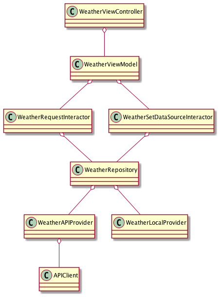

# WeatherApp

Here a brief description about the main topics:

## Architecture

The architecture has these layers:

- **ViewController**: Subscribe to a View Model Publisher to get the data or events.

- **ViewModel**: Create view representable objects and response to View Controller events.

- **Interator**: Diferent use cases and bussines logic.

- **Repository**: Choose between different data providers.

- **DataProvider**: Get the data from data sources.

I've used Dependency Injection to allow testing.

This's an object diagram of Weather module:

## Swift

The minumum developer targer is iOS 13 because **Combine** and **Compositional Layout**.

## UI

I've used UIKIT because I don't feel confident wiht Swift UI yet to do something a bit complex, for example: UICollectionViewCompositionalLayout to setup the layout in the collection view.

I've implemented a basic Dark Mode with Appearance Proxy and Color Set catalogue.

## Testing

I've added [TestSpy](https://github.com/f-meloni/TestSpy) util tool. This helps to create spy object, records calls and assert some conditions.

I'm using [Sourcery](https://github.com/krzysztofzablocki/Sourcery) to auto-generate spy objects, see build script in WeatherAppUnitTests target.

There are three diferent test targets:

- **WeatherAppUnitTests**: Unit tests, all of them are using spy objects.

- **WeatherAppIntegrationTests**: Integration tests, they're using HTTPStubProtocol to provide STUB network responses globally, then check how the ViewModel behaives.

- **WeatherAppUITests**: UI Tests, they're using a launch environment tag to setup the APP before start. Here we have two type of tests:
  
    -- UI Testing: These tests are checking that the view is shown as expected when the ViewModel emit an event (Success/Error)
  
    -- System test:  Testing the full solution (Black box testing) by launching the application as it is and performing some actions to check their results at UI layer.

- **WeatherAppSnapshotTests**: Snapshot Tests, basic test of the main screen using snapshot

## Code Quality

[SwiftLint](https://github.com/realm/SwiftLint) is setup in all targets.

I've used [CPD](https://pmd.github.io/latest/pmd_userdocs_cpd.html) to detect duplicate code blocks automatically inline. (see build scripts). 

## Continous Integration

Fastlane and my own Jenkins.

